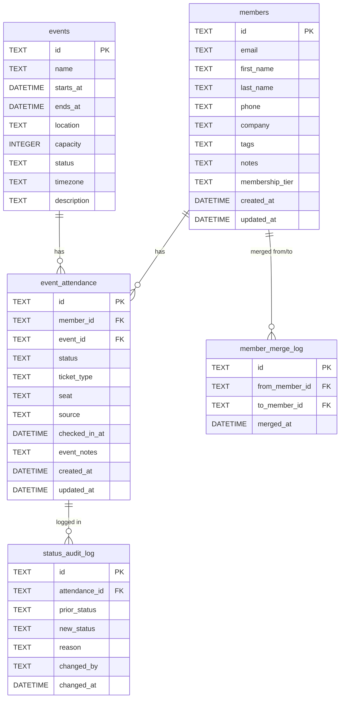

# EventDeskPro — Data Schema (ASCII) v1.1 (Base, as implemented)
Last Updated: 2025-08-29 23:15:47Z

This schema mirrors the current code and base SQL in `SCHEMA.sql`. It uses the actual table names, key types, and status codes the app expects. Optional extensions (analytics views, FTS, settings) are listed separately to avoid confusion with the implemented base.

Legend: `PK` = primary key · `FK` = foreign key · `UQ` = unique · `NN` = NOT NULL · `DEF` = default · `CHK` = check

```
┌──────────────────────────────────────────── members ────────────────────────────────────────────┐
│ PK  id                 TEXT                                                                NN   │
│ UQ  email              TEXT                                (unique; may be NULL)               │
│     first_name         TEXT                                                                     │
│     last_name          TEXT                                                                     │
│     phone              TEXT                                                                     │
│     company            TEXT                                                                     │
│     tags               TEXT                                                                     │
│     notes              TEXT                                                                     │
│     membership_tier    TEXT                          DEF 'attendee'                             │
│     created_at         DATETIME                      DEF CURRENT_TIMESTAMP                      │
│     updated_at         DATETIME                      DEF CURRENT_TIMESTAMP                      │
└─────────────────────────────────────────────────────────────────────────────────────────────────┘

┌───────────────────────────────────────────── events ─────────────────────────────────────────────┐
│ PK  id                 TEXT                                                                NN   │
│     name               TEXT                                                                NN   │
│     starts_at          DATETIME                                                           NN   │
│     ends_at            DATETIME                                                           NN   │
│     location           TEXT                                                                     │
│     capacity           INTEGER                                                                  │
│     status             TEXT                                                                     │
│     timezone           TEXT                          DEF 'UTC'                                  │
│     description        TEXT                                                                     │
└─────────────────────────────────────────────────────────────────────────────────────────────────┘

┌────────────────────────────────────── event_attendance ─────────────────────────────────────────┐
│ PK  id                 TEXT                                                                NN   │
│ FK  member_id          TEXT                          NN  → members.id                         │
│ FK  event_id           TEXT                          NN  → events.id                          │
│     status             TEXT                          NN  CHK ('preregistered','walkin',       │
│                                                         'checkedin','dna') DEF 'preregistered' │
│     ticket_type        TEXT                                                                     │
│     seat               TEXT                                                                     │
│     source             TEXT                                                                     │
│     checked_in_at      DATETIME                                                                 │
│     event_notes        TEXT                                                                     │
│     created_at         DATETIME                      DEF CURRENT_TIMESTAMP                      │
│     updated_at         DATETIME                      DEF CURRENT_TIMESTAMP                      │
│ UQ  (member_id, event_id)                                                                       │
└─────────────────────────────────────────────────────────────────────────────────────────────────┘

┌──────────────────────────────────────── status_audit_log ───────────────────────────────────────┐
│ PK  id                 TEXT                                                                NN   │
│ FK  attendance_id      TEXT                          NN  → event_attendance.id                │
│     prior_status       TEXT                                                                     │
│     new_status         TEXT                                                                NN   │
│     reason             TEXT                                                                     │
│     changed_by         TEXT                                                                     │
│     changed_at         DATETIME                      DEF CURRENT_TIMESTAMP                      │
└─────────────────────────────────────────────────────────────────────────────────────────────────┘

┌──────────────────────────────────────── member_merge_log ───────────────────────────────────────┐
│ PK  id                 TEXT                                                                NN   │
│ FK  from_member_id     TEXT                          NN  → members.id                         │
│ FK  to_member_id       TEXT                          NN  → members.id                         │
│     merged_at          DATETIME                      DEF CURRENT_TIMESTAMP                      │
└─────────────────────────────────────────────────────────────────────────────────────────────────┘
```

Indexes (as implemented):
```
CREATE INDEX IF NOT EXISTS idx_members_email ON members(email);
CREATE INDEX IF NOT EXISTS idx_event_attendance_event  ON event_attendance(event_id);
CREATE INDEX IF NOT EXISTS idx_event_attendance_status ON event_attendance(status);
CREATE INDEX IF NOT EXISTS idx_event_attendance_member ON event_attendance(member_id);
```

Status codes (authoritative): `preregistered`, `walkin`, `checkedin`, `dna`.

---

## Optional Extensions (proposed; add via migrations when ready)

To keep the base schema stable, optional features live in separate migration docs. See `DB_SQLITE_SETUP.md` for SQL and guidance.

- Analytics views: `v_event_counts`, `v_event_reg_percent`, `v_event_noshow_rate` (Reg% and No‑show formulas aligned to SSOT).
- Full‑text search: `members_fts` (FTS5) plus sync triggers, if SQLite build supports FTS5.
- Settings K/V: `app_settings` for palette/defaults/timezone (not currently used by code).
- Future UX columns: `confirmed`, `is_vip` on `event_attendance` (backward‑compatible; current app ignores unknown columns).

---

## State Machine (runtime logic, summarized)

```
preregistered --(check-in)--> checkedin
preregistered --(mark DNA; override if early)--> dna
walkin       --(check-in)--> checkedin
checkedin    --(undo; reason required)--> preregistered/walkin/dna
```

All transitions are validated in Rust (FFI). Overrides and undo require reason/flags; changes are recorded in `status_audit_log`.

---

Notes
- This document mirrors `SCHEMA.sql` and the current Rust core implementation.
- For deployment best‑practices (WAL, foreign_keys, busy_timeout) and optional views/FTS, see `DB_SQLITE_SETUP.md`.

---

## Mermaid ER Diagram (overview)


